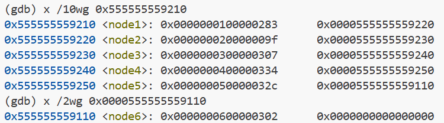

# 从“拆炸弹”认识计算机程序——汇编语言
## 一、实验简介
在实验文件夹中，我们首先看到了一个二进制文件和一个残缺不全的C语言代码文件：

二进制文件无法查看，因为它是完整的C语言代码文件经编译链接后产生的可执行文件，看来我们需要根据程序运行的原理来认识这份二进制文件，从而破译完成的C语言代码文件，并安全拆除所有炸弹。
## 二、实验过程
从残缺的C语言代码文件来看，程序的功能是读入一行字符串input，经过不同phase的函数验证后，得到炸弹被拆除或爆炸的结果，因此我们要做的就是找到六个正确的字符串input，通过六个phase的函数验证，完成拆除炸弹的目标。

正确的input藏在bomb这个二进制文件中，那么我们怎样才能找到答案呢？幸运的是，我们有反汇编器这一强大的工具，能够将机器代码反汇编为汇编代码，通过阅读汇编代码，我们就可以解开bomb中的谜题。

在这里我们需要温习一下程序运行的大致过程：CPU通过执行一条一条的机器指令，完成程序这一”指令清单“交给它的任务，而汇编代码就是相较于机器代码更容易被人理解的”指令清单“。

接下来让我们做一些准备工作：

进入bomb所在文件夹，在终端中输入以下指令：
```bash
touch solution.txt
```
我们创建了一个空白文本文档`solution.txt`，用来存放六个正确的字符串input。
然后在终端中输入以下指令：
```bash
objdump -d bomb > test.s
```
我们就得到了bomb这个二进制文件的汇编代码`test.s`，通过阅读汇编代码，来分析程序的功能。

理解了上面的内容后，我们就可以开始有趣的拆炸弹之旅了：
### phase 1
汇编代码如下：

根据我们在计算机系统导论这门课上学到的有关汇编语言的知识，我们可以轻松地解释这个汇编程序的功能：

从第二行开始，首先申请栈空间，为函数调用做准备；

然后将读入字符串的地址送寄存器`%rsi`，作为被调函数的实参；

第四行调用函数`strings_not_equal`，检查读入与正确字符串是否一致；

函数的返回值存储在`%eax`中，指令`test %eax,%eax`的作用是测试`%eax`，若为零则读入了正确的字符串，否则读入错误，引爆炸弹；

综上所述，我们想要得到正确的字符串，就需要在程序运行时找到字符串的地址，并读取对应的内存，才能获得正确字符串的内容。

这时我们就需要借助另一个强大工具的帮助，它就是gdb。

终端中输入以下指令，使gdb装载可执行二进制文件：
```bash
gdb bomb
```
此时gdb准备开始执行二进制文件bomb。

但是由于我们并不知道正确的字符串，所以直接执行bomb必然会引爆炸弹，因此我们需要设置一些断点，在CPU执行每个phase函数之前暂停下来，通过查询程序运行时内存来完成我们的目的。

设置断点指令为：

```bash
b phase_1
```

这样我们就可以在程序停在phase 1“门口”后查找正确的字符串。

带输入运行指令为：

```bash
run < solution.txt
```

此时程序停在phase 1”门口“，通过单步执行指令`ni`，我们来到下面这一条指令：

其中`x /i $rip`为查看当前运行指令。

此时我们可以得到送给`%rsi`的内容，即字符串的地址为`0x5555555570b0`，使用以下指令查看内存：

```bash
x /s 0x5555555570b0
```

这样我们就看到了我们想要的字符串：


成功拆除phase 1的炸弹！
### phase 2
部分汇编代码如下：

分析其主要功能，是先读入六个数字，再通过一系列栈操作完成这六个数的检查。

`read_six_numbers`的汇编代码如下：


通过分析得出`%rsi`为栈地址，向高地址（栈底）每四个字节存放一个数，并将前四个数的地址送给对应寄存器；后两个数的地址压栈；接下来将`%rsi`指向数组首址，开始读入数字并将数字存入栈中对应位置。同时统计读入数字的数量，少于六个引爆炸弹。

检查开始读入前的内存，发现结果与我们的猜想一致：

回到phase 2的汇编代码，由于存放的顺序是地址由低到高，所以`%rsp`中的地址存放的是第一个数，以此类推。

可以看出第一个数必须是1，否则引爆炸弹。

如果第一个数是1，把第一个数的地址送`%rbx`，作为基址，最后一个数的地址送`%rbp`，作为尾址。

接下来进入一个循环，这里我们只分析第一次循环：

`%rbx`中的地址存放第一个数，把这个数送`%eax`以后再乘2，与下一个数作比较，如果不相等则引爆炸弹，如果相等则循环继续，`%rbx`指向下一个数的地址。

不断重复这一过程，直到`%rbx`等于尾址，循环结束。

由于第一个数一定是1，因此正确的数列应当是`1 2 4 8 16 32`。

成功拆除phase 2的炸弹！

### phase 3

汇编程序较长，且有大量重复代码片段出现，结合提示，知道程序结构如下：

```c
switch ()
    case:
		...
    case:
        ...
```

先看开头部分汇编代码：

功能与phase 2中`read_six_numbers`类似，可以认为是检查读入数字不得少于三个，否则引爆炸弹；

进一步观察得出一个数字长为一个字节，可能是一个`char`型字符，另外两个数字长为四个字节，是`int`型。

它们在读入中的顺序如何？这需要我们检查开始读入时的内存：

确定读入顺序为数字，字符，数字。

再看下一部分：

首先检查第一个数字是否大于7，若大于7则引爆炸弹，若不大于7则送`%rax`。

`%rdx`为数组地址，`%rax`为数组下标，按数组下标从数组中取出一个数符号扩展传送给`%rax`，新的`%rdx+%rax`即为`jmp`的目标地址，并由此决定跳往的case分支。

同样检查存放数组的内存：

假设第一个数字为0，则跳转地址为

`0x555555557120+0xffffffffffffe57c=0x55555555569c`

查询该地址存放的指令：

在汇编代码中找到对应位置：

这时我们知道了第二个数字只能为`0x77=119`，否则引爆炸弹。

同时`%eax=0x67`，我们跳到下一个地址：

显然，此时字符必须等于`%al`，即`%eax`的最低字节，为`0x67='g'`。

这样我们确定了正确的读入为`0 g 119`，成功拆除炸弹！

### phase 4

首先仍然要确定读入：

部分汇编代码：

读入的第一个数应当小于等于14，否则引爆炸弹。

函数`func4`的实参有三个，分别为`%edx=14,%esi=0,%edi=(%rsp)`。

`func4`的汇编代码：

可以看到有自身调用自身，是一个递归函数。

设`%edx=n,%edi=k,%ebx=t,%eax=i,%esi=j`，则有：

```c
n=14;
j=0;
func4:
t0=t;
i=n;
i-=j;
t=i;
t=(t>>31);
t=t+i;
t=(t>>1);
t=t+j;
if(t>k){
    n=t-1;
    func4();
}
if(t<k){
    j=t+1;
    func4();
}
i+=t;
t=t0;
return i;
```

再看汇编代码的尾部：


若返回值不为15或者第二个数字不为15，则炸弹被引爆。

递归程序分析较为复杂，因此采用较为简单的方式寻找答案。

猜想第一个数字可能有若干个值被接受，且0-14范围内必有解，由于引爆炸弹是允许的，所以我们可以通过排除法一个一个验证0-14，经过尝试，第一个数字是5时，不会引爆炸弹，因此我们找到一个合法解`5 15`，成功拆除炸弹！

当然可以根据递归程序验证5可以被接受，这里不做赘述。

### phase 5

汇编代码如下：

首先调用函数`string_length`，查看汇编代码：

`%rbx`中存放字符串地址，变址`%rdi`初始也为字符串地址；

`%rdi`指向的内存中存放字符串终结符`\0`时循环终止，返回字符串长度；

字符串长度若不为6则炸弹爆炸。

接下来进入phase_5中的循环，变址`%rax`初始化为`%rbx`，将尾址送`%rdi`；

统计量`%ecx`初始化为零；

`%rsi`为数组地址，`(%rax)`取低四位作为数组下标，从数组中取数累加到`%ecx`中。

可以认为该过程类似于计算一个字符串的哈希值。

打印内存得到哈希表：

从结尾处读出哈希值`%ecx!=0x3a`时炸弹爆炸，因此要使字符串的哈希值为`0x3a=58`。

容易试出一个字符串`00adee`，每个字符的ASCII码取低四位的结果为`001455`，其哈希值为`2+2+10+12+16+16=58`。成功拆除炸弹！

### phase 6

汇编代码较长，需要通过拆解法分析：

首先读入六个数字并存入栈中；

接下来分析循环的汇编代码：

这是一个双重循环，`%r12,%rbp,%r13,%rsi`均初始化为第一个数的地址，`%r14`初始化为1，表示已经检查了多少个数两两互异，每次外层循环开始时先检查变址`%rbp`中存放的数（送`%eax`），若其大于6，则引爆炸弹；否则进入内层循环，将`%r14`送`%rbx`，作为剩下未检查的数的起始下标，检查是否存在与当前`%rbp`中存放的数相等的数，若有则引爆炸弹；若无则将`%r14`加一，`%rbp`指向下一个数，本次外层循环结束；当`%r14==6`时，外层循环结束，此时读入满足不大于6且互不相同。


仍然是一个二重循环，从代码可以看出这六个数字必须大于等于1，否则无法进入内层循环；外层循环从栈中第一个数开始遍历，若该数等于1，则将`%rdx`放入栈中处于这组数字下方的内存中，并遍历下一个数字；这里数字事实上代表节点编号（1~6），初始的`%rdx`中存放着第一个节点的地址。若该数大于1，则进入内层循环，内层循环是按顺序访问链表的过程，每个节点的地址八个字节后的内存中存放着下一个结点的地址（指针域），从而实现对链表中下一个结点的访问，完成内层循环后，将以该数为编号的节点的地址放入栈内存中。如此便将六个节点的地址放入了栈内存中。


这段代码将每个节点读入顺序中的下一个节点的地址写入指向自身的地址八个字节后的内存中。

这样完成了链表的重新指向，将链表中各节点由原始顺序排列改为了读入顺序排列。

为了获取正确的读入顺序，我们需要查看内存：

可以看到，每个节点的地址指向的内存分为数据域和指针域，前八个字节为数据域，后八个字节为数据域。并且前五个结点的内存物理连续，6号节点在另外一片内存中。

正确的顺序从结尾段代码中得出：

`%ebp`为循环次数，`%rbx`为当前节点的地址，初始化为新链表首个节点的地址。下一个节点的地址送`%rax`，取出下一个节点数据域低四个字节送`%eax`，并与当前节点数据域低四个字节作比较，若当前节点的数据域低四个字节小于等于下一个节点的数据域低四个字节，则继续比较，否则引爆炸弹。

因此正确的顺序为所有节点按数据域低四个字节由小到大排序后的顺序，即`2 1 6 3 5 4`。

至此，我们成功拆除了所有炸弹。

## 三、心得体会和收获

通过这次实验，我深入了解了程序的机器级表示，明白了程序在机器层面是如何执行的，同时熟练掌握了汇编代码的阅读理解，反汇编工具的使用，以及调试工具gdb的使用，可谓是受益颇多。更重要的是，我收获了对于计算机系统这一方面的兴趣，而这离不开各位授课教师的启蒙与指导。总而言之，本学期的计算概论以及计算机系统导论课程给我留下了很深刻的印象。