# F3 数字逻辑电路基础

先放一个异或门的电路图：

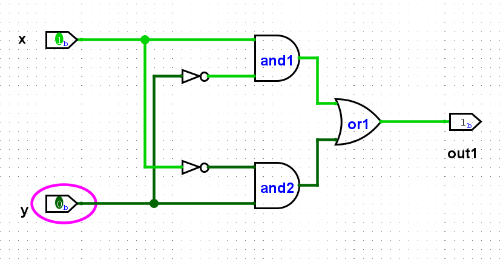

## 通过晶体管搭建门电路

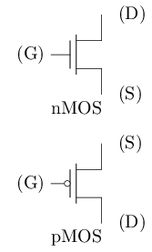

**nMOS晶体管的电气特性**
- 当栅极电压和源极电压之间的电压差($V_{GS}$)大于阈值电压时，晶体管导通，电流可以通过。
- 当栅极电压和源极电压之间的电压差($V_{GS}$)小于阈值电压时，晶体管截止，电流不能通过。
- 可简记为：栅极电压高于源极电压时，晶体管导通，电流可以通过。

**pMOS晶体管的电气特性**
- 当源极电压和栅极电压之间的电压差($V_{SG}$)大于阈值电压时，晶体管导通，电流可以通过。
- 当源极电压和栅极电压之间的电压差($V_{SG}$)小于阈值电压时，晶体管截止，电流不能通过。
- 可简记为：源极电压高于栅极电压时，晶体管导通，电流可以通过。

### 例：与非门
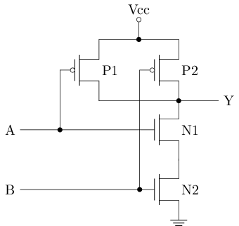

分四种情况讨论：
| A | B | nMOS1 | nMOS2 | pMOS1 | pMOS2 | Y |
|---|---|-------|-------|-------|-------|------|
| 0 | 0 | 截止 | 截止 | 导通 | 导通 | 1 |
| 0 | 1 | 截止 | 导通 | 导通 | 截止 | 1 |
| 1 | 0 | 导通 | 截止 | 截止 | 导通 | 1 |
| 1 | 1 | 导通 | 导通 | 截止 | 截止 | 0 |

因此逻辑表达式为：
$$
Y = \overline{AB}
$$

这就是与非门。

将与非门的输出连接到非门的输入，就得到了与门。

### Ex1:
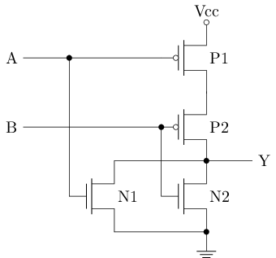

分四种情况讨论：
| A | B | nMOS1 | nMOS2 | pMOS1 | pMOS2 | Y |
|---|---|-------|-------|-------|-------|------|
| 0 | 0 | 截止 | 截止 | 导通 | 导通 | 1 |
| 0 | 1 | 截止 | 导通 | 导通 | 截止 | 0 |
| 1 | 0 | 导通 | 截止 | 截止 | 导通 | 0 |
| 1 | 1 | 导通 | 导通 | 截止 | 截止 | 0 |

因此逻辑表达式为：
$$
Y = \overline{A+B}
$$

这就是或非门。

将或非门的输出连接到非门的输入，就得到了或门。

### 例：异或门的搭建与优化

开头那个图就是异或门的一种搭建方式，需要22个晶体管。

思考后发现，异或门可以用与门和或非门来搭建。

逻辑表达式为：
$$
Y = A\oplus B = \overline{AB + \overline{A+B}}
$$

因此可以搭建如下电路：

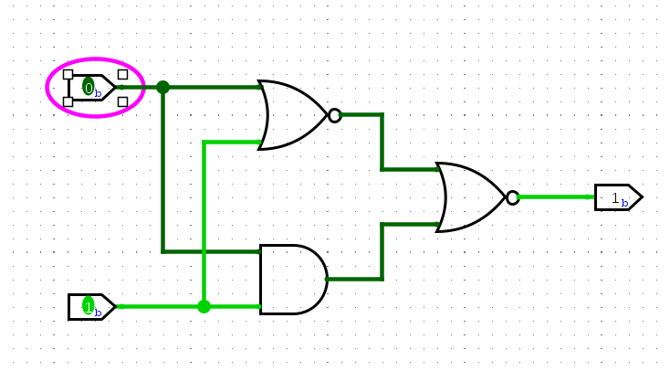

该门电路需要14个晶体管。

进一步考虑异或门的全定制电路：
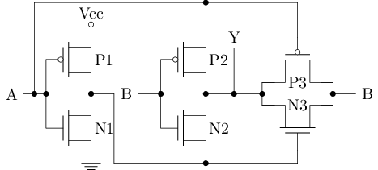

这个电路比之前的或非门稍微复杂一些，它结合了 **CMOS 反相器**和**传输门 (Transmission Gate)**。其核心功能是一个 **二输入异或门 (XOR Gate)**。

我们可以将电路拆解为三个主要部分进行分析：

#### 1. 电路组成部分

* **左侧反相器 (P1, N1)：** 输入为 **A**。其输出为 $\overline{A}$。
* **中间反相器 (P2, N2)：** 输入为 **B**。注意它的供电端：其上拉 PMOS (P2) 连接到输入 **A**，而下拉 NMOS (N2) 连接到$\overline{A}$。这实际上是一个**受控反相结构**。
* **右侧传输门 (P3, N3)：** 输入端连接到 **B**，输出端连接到 **Y**。
* N3 的控制极（栅极）连接到 $\overline{A}$（左侧反相器的输出）。
* P3 的控制极（栅极）连接到 **A**。

---

#### 2. 逻辑状态推导

我们根据输入 **A** 的状态来划分两种情况：

情况 A：当 $A = 0$ 时

* **左侧反相器：** 输出 $\overline{A} = 1$。
* **中间反相器：** P2 的源极接 A（即接地），N2 的源极接 $\overline{A}$（电势高），因此无论 B 是什么，P2 和 N2 均截止。
* **右侧传输门：** 无论B是什么，总有一个晶体管导通，即**传输门导通**，将B连接到Y。
* **结论：** 输出 $Y$ 直接等于输入 $B$。即当 $A=0$ 时，$Y = B$。

情况 B：当 $A = 1$ 时

* **左侧反相器：** 输出 $\overline{A} = 0$。
* **右侧传输门：** 无论B是什么，两个晶体管均截止，即**传输门截止**，切断了B到Y的连接。
* **中间反相器：** P2 的源极接 A（即接 $V_{cc}$）。此时 P2 和 N2 构成了一个标准的以 B 为输入的反相器。
* **结论：** 输出 $Y$ 等于 $B$ 的反相信号。即当 $A=1$ 时，$Y = \overline{B}$。

---

#### 3. 真值表与结论

| A | B | Y |
| --- | --- | --- |
| 0 | 0 | **0** (跟随 B) |
| 0 | 1 | **1** (跟随 B) |
| 1 | 0 | **1** (B 的反相) |
| 1 | 1 | **0** (B 的反相) |

* **逻辑功能：** 该电路实现的是 **异或 (XOR)** 运算，表达式为 $Y = A \oplus B$。
* **设计特点：** 这种设计使用了 6 个晶体管，比标准的 12 管 CMOS 异或门更节省空间，常用于高速、低功耗的逻辑单元设计中。

### Ex2:

要求设计一个同或门，易知同或门就是异或门的反相输出，因此可以将异或门的输出连接到非门的输入，就得到了同或门。

考虑优化，同或门可以用与非门和或门来搭建，逻辑表达式为：
$$
Y = \overline{\overline{AB}(A+B)}
$$

因此可以搭建如下电路：
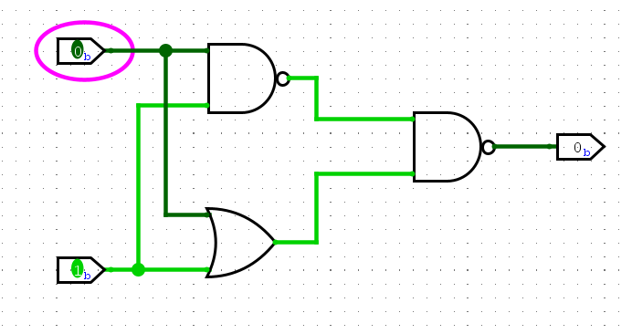

只需要14个晶体管。

同或门的全定制电路设计只需在异或门全定制电路的基础上，将逻辑稍加改动：
- 把A接到N2的源极，$\overline{A}$接到P2的源极。
- 把A接到N3的栅极，$\overline{A}$接到P3的栅极。

在logisim中实现如下：
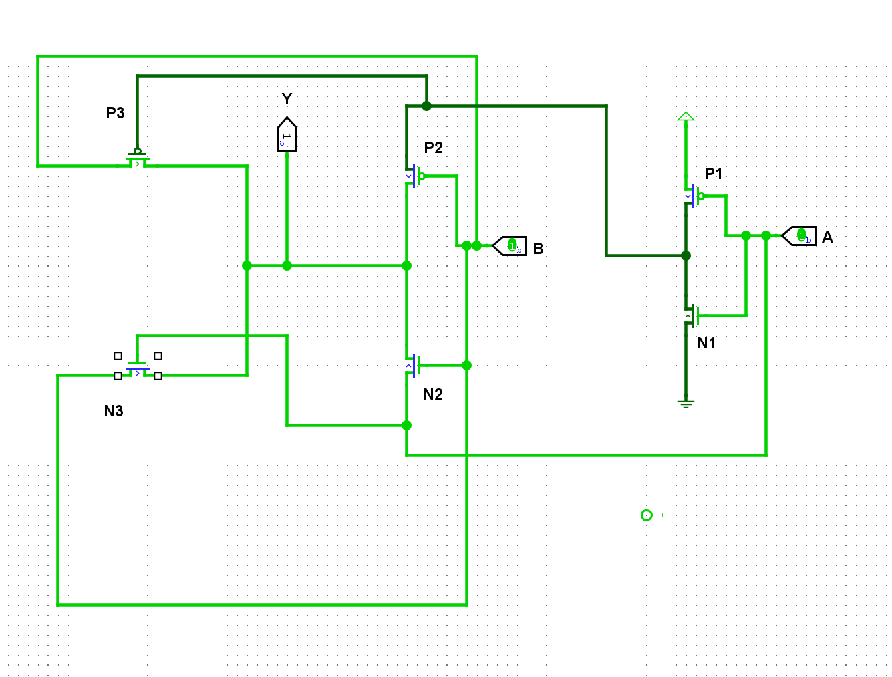

## 通过门电路搭建基本组合逻辑电路

### 译码器

2-4译码器的逻辑表达式为：
$$
Y_0 = \overline{A_0} \overline{A_1}
$$
$$
Y_1 = A_0 \overline{A_1}
$$
$$
Y_2 = \overline{A_0} A_1
$$
$$
Y_3 = A_0 A_1
$$

电路图略。

### logisim练习

将2-4译码器封装为子电路，并在logisim中使用该子电路搭建3-8译码器。

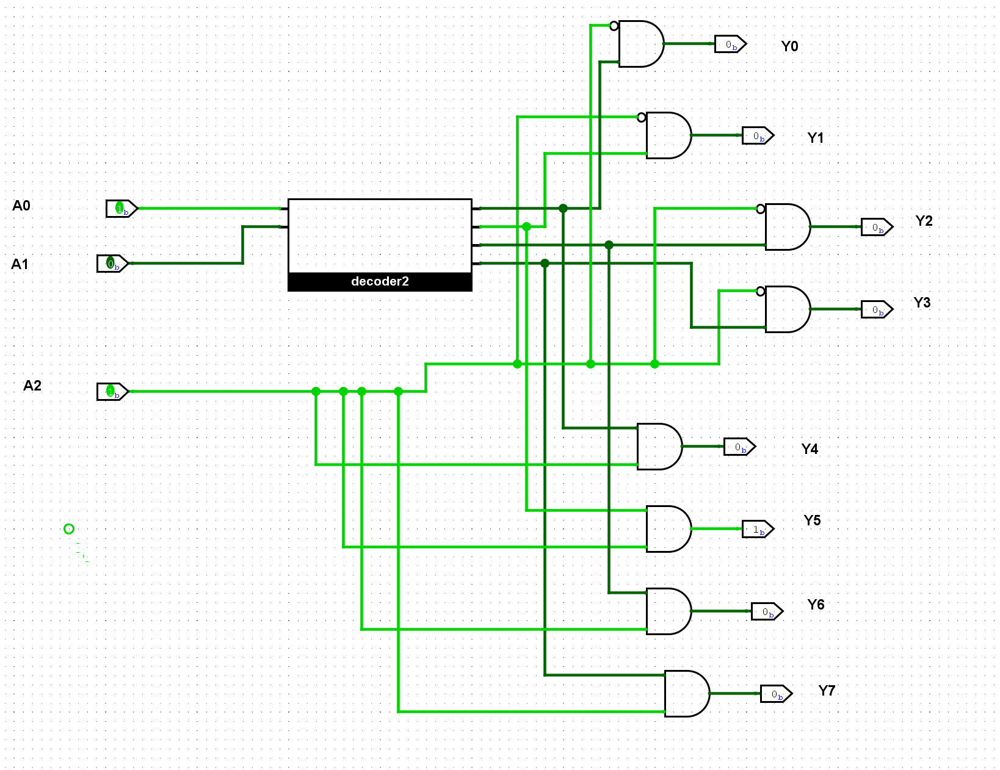

根据逻辑表达式搭建支持十六进制数字的七段数码管译码器。

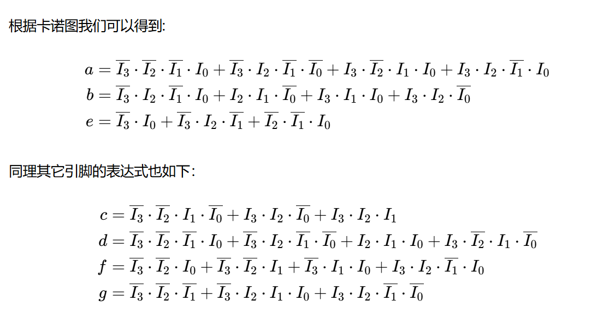

逻辑表达式已给出，电路略。

简单给出显示电路：
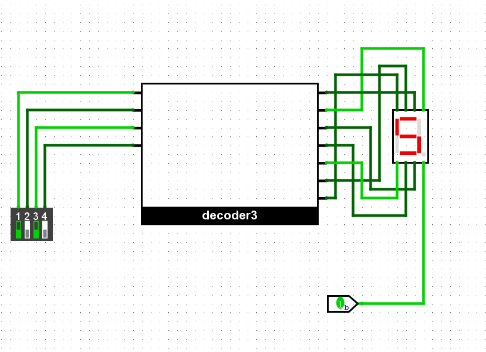

### 编码器

4-2优先编码器的逻辑表达式为：
$$
Y_0 = \overline{A_3} \overline{A_2} A_1 + A_3

Y_1 = \overline{A_3} A_2 + A_3
$$

电路图略。

选做任务略。

### 多路选择器

1位2选1选择器可用一个1-2译码器和若干门电路搭建，电路图如下：
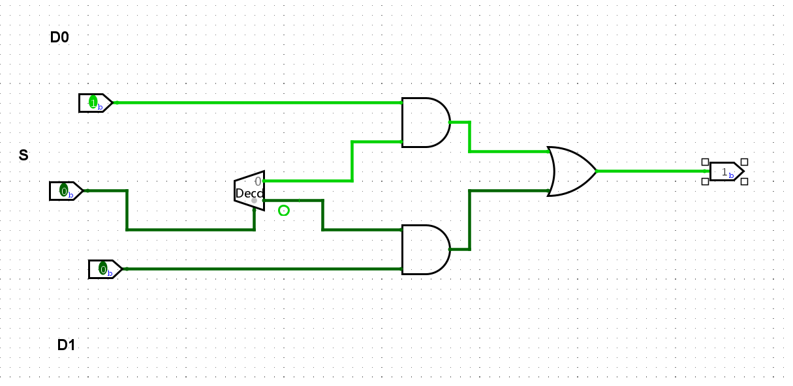

### logisim练习

搭建一个三位4选1选择器。

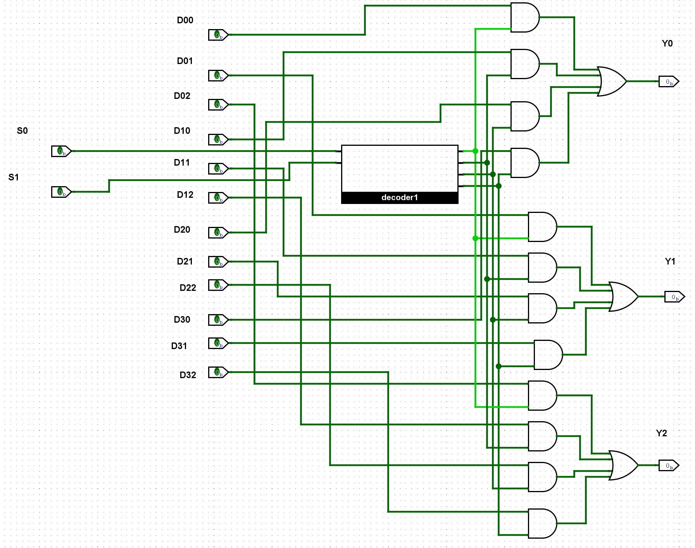

为了实现通过5个拨码开关（4个数据输入，1个模式选择）控制一个七段数码管，显示十进制或十六进制，可以采用以下电路设计：

#### 设计思路
- 4个数据拨码开关（D3-D0）输入4位二进制数，表示0-15。
- 1个模式选择开关M：M=0时十进制显示（仅0-9有效，10-15灭）；M=1时十六进制显示（0-9及A-F）。
- 使用4-16线译码器（如74LS154）将4位输入转换为16个输出Y0-Y15，每个Y对应一个数值。
- 根据七段数码管（共阴极，a为最低位）的段码表，确定每个段在十进制和十六进制下点亮的数字，然后用或门组合译码器输出，并通过M控制高位（10-15）是否参与。

#### 七段数码管段码表（共阴极，a-g顺序，a为LSB）
| 数字 | 段码 (g f e d c b a) | 十六进制 |
|------|----------------------|----------|
| 0    | 0 1 1 1 1 1 1        | 0x3F     |
| 1    | 0 0 0 0 1 1 0        | 0x06     |
| 2    | 1 0 1 1 0 1 1        | 0x5B     |
| 3    | 1 0 0 1 1 1 1        | 0x4F     |
| 4    | 1 1 0 0 1 1 0        | 0x66     |
| 5    | 1 1 0 1 1 0 1        | 0x6D     |
| 6    | 1 1 1 1 1 0 1        | 0x7D     |
| 7    | 0 0 0 0 1 1 1        | 0x07     |
| 8    | 1 1 1 1 1 1 1        | 0x7F     |
| 9    | 1 1 0 1 1 1 1        | 0x6F     |
| 10(A)| 1 1 1 0 1 1 1        | 0x77     |
| 11(b)| 1 1 1 1 1 0 0        | 0x7C     |
| 12(C)| 0 1 1 1 0 0 1        | 0x39     |
| 13(d)| 1 0 1 1 1 1 0        | 0x5E     |
| 14(E)| 1 1 1 1 0 0 1        | 0x79     |
| 15(F)| 1 1 1 0 0 0 1        | 0x71     |

#### 各段点亮数字（十六进制）
- **a段**：0,2,3,5,6,7,8,9,10,12,14,15
- **b段**：0,1,2,3,4,7,8,9,10,13
- **c段**：0,1,3,4,5,6,7,8,9,10,11,13
- **d段**：0,2,3,5,6,8,9,11,12,13,14
- **e段**：0,2,6,8,10,11,12,13,14,15
- **f段**：0,4,5,6,8,9,10,11,12,14,15
- **g段**：2,3,4,5,6,8,9,10,11,13,14,15

#### 十进制显示
当M=0时，仅0-9有效，10-15全灭，因此每个段只取上述列表中0-9的部分。

#### 逻辑表达式（基于译码器输出Y0~Y15）
设Y0-Y15为译码器输出（高电平有效），M为模式选择（1=十六进制，0=十进制）。则各段输出为：
- a = (Y0+Y2+Y3+Y5+Y6+Y7+Y8+Y9) + M·(Y10+Y12+Y14+Y15)
- b = (Y0+Y1+Y2+Y3+Y4+Y7+Y8+Y9) + M·(Y10+Y13)
- c = (Y0+Y1+Y3+Y4+Y5+Y6+Y7+Y8+Y9) + M·(Y10+Y11+Y13)
- d = (Y0+Y2+Y3+Y5+Y6+Y8+Y9) + M·(Y11+Y12+Y13+Y14)
- e = (Y0+Y2+Y6+Y8) + M·(Y10+Y11+Y12+Y13+Y14+Y15)
- f = (Y0+Y4+Y5+Y6+Y8+Y9) + M·(Y10+Y11+Y12+Y14+Y15)
- g = (Y2+Y3+Y4+Y5+Y6+Y8+Y9) + M·(Y10+Y11+Y13+Y14+Y15)

#### 电路实现
1. 将4个数据拨码开关接至4-16译码器的地址输入端（如A、B、C、D）。
2. 译码器的16个输出Y0-Y15分别对应数值0-15。
3. 对于每个段，使用或门（或二极管或门）将相应的Y信号组合。例如a段，将Y0、Y2、Y3、Y5、Y6、Y7、Y8、Y9通过一个8输入或门得到第一部分；再将Y10、Y12、Y14、Y15通过一个4输入或门，然后与M相与（用与门），最后将两部分结果通过一个2输入或门得到a。
4. 所有7个段的输出分别接至七段数码管的对应引脚（a-g）。注意数码管若为共阴极，则高电平点亮；若为共阳极，则所有输出需取反（可在输出端加反相器）。

#### 说明
- 当M=0时，高位部分被屏蔽，仅0-9有效，且10-15时所有段为0（数码管熄灭）。
- 当M=1时，高位参与显示，10-15显示为A-F。
- 该设计使用中规模集成电路，简洁可靠。

### 比较器

搭建四位比较器：
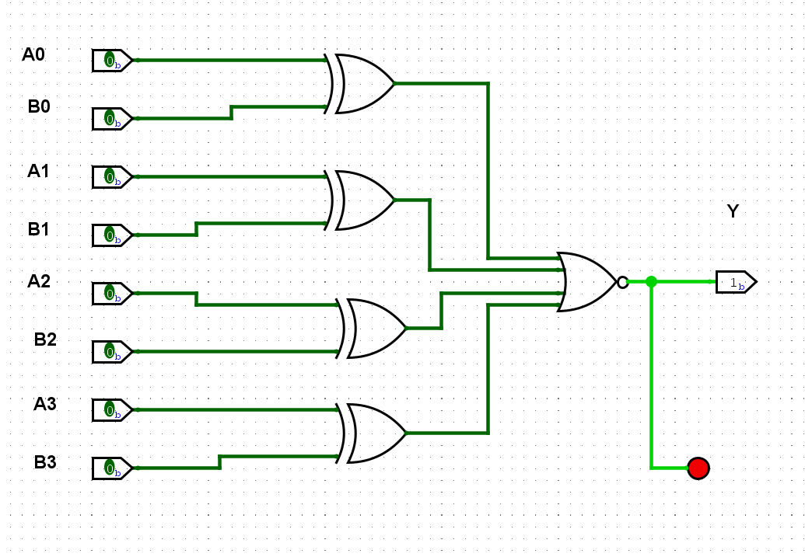

### 加法器

搭建一位全加器：
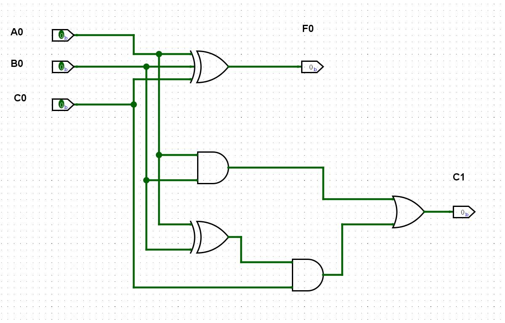

搭建四位全加器：
逻辑较简单，略。

### logisim练习

搭建四位补码加法器：

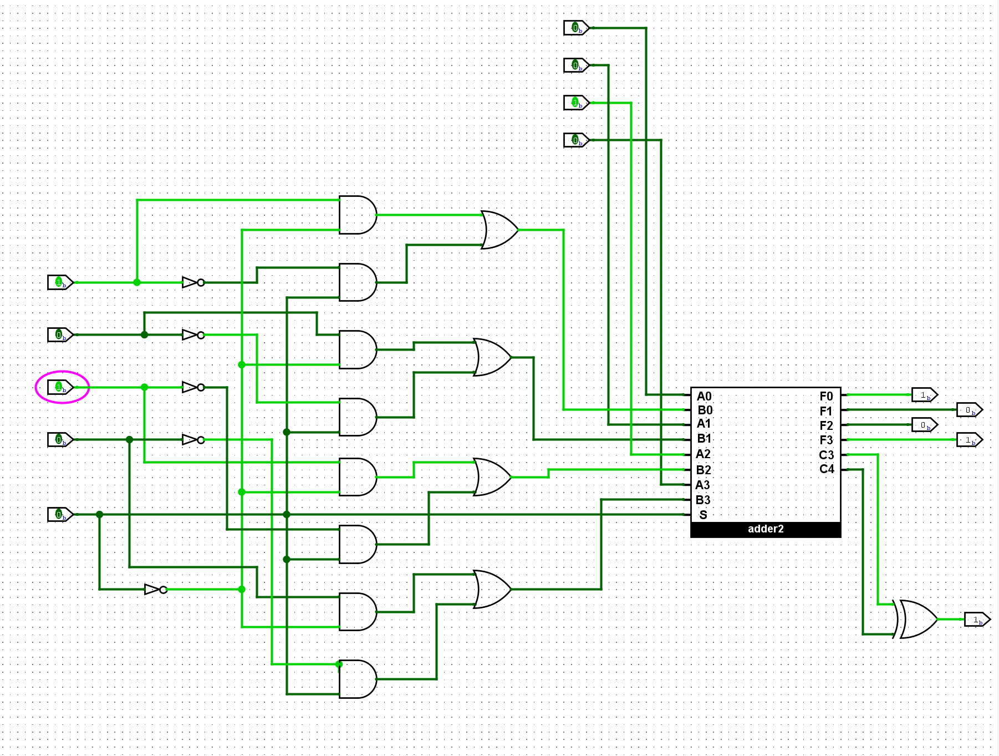

## 时序逻辑电路

### RS锁存器

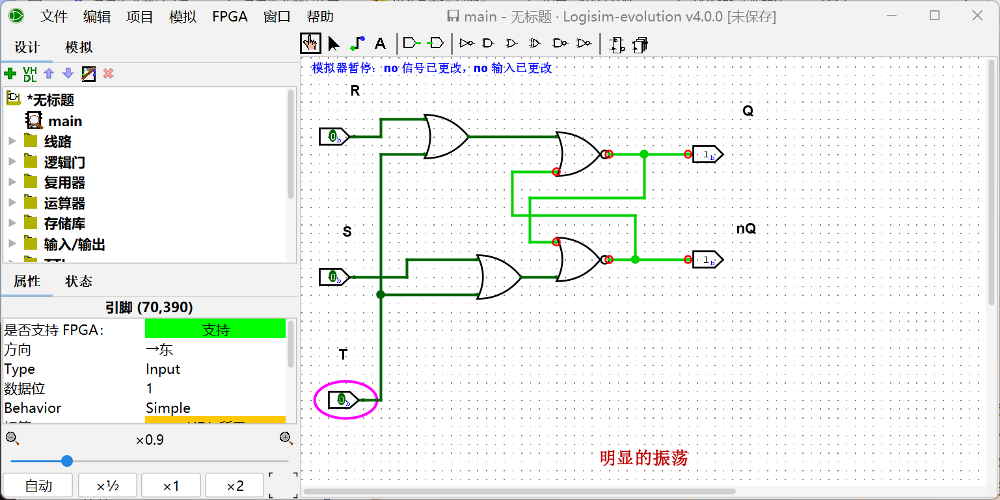

RS锁存器的逻辑表达式为：
$$
Q = \overline{R} Q_{prev} + S
$$
$$
\overline{Q} = \overline{S} Q_{prev} + R
$$

### D锁存器

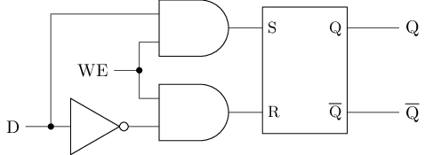

真值表：

| D | WE | Q_{prev} | R | S | Q | \overline{Q} |
|---|----|----------|---|---|---|-------------|
| 0 | 0 | 0 | 0 | 0 | 0 | 1 |
| 0 | 0 | 1 | 0 | 0 | 1 | 0 |
| 0 | 1 | 0 | 1 | 0 | 0 | 1 |
| 0 | 1 | 1 | 1 | 0 | 0 | 1 |
| 1 | 0 | 0 | 0 | 0 | 0 | 1 |
| 1 | 0 | 1 | 0 | 0 | 1 | 0 |
| 1 | 1 | 0 | 0 | 1 | 1 | 0 |
| 1 | 1 | 1 | 0 | 1 | 1 | 0 |

复位信号reset优先级应高于写使能信号WE。

因此当 reset = 1 时，$R = 1$，$S = 0$，$Q = 0$，$\overline{Q} = 1$。

当 reset = 0 时，D锁存器的行为如真值表所示。

因此：

$$
R = reset + WE \times \overline{D}
$$
$$
S = \overline{reset} \times WE \times D
$$

在logisim中搭建如下电路：
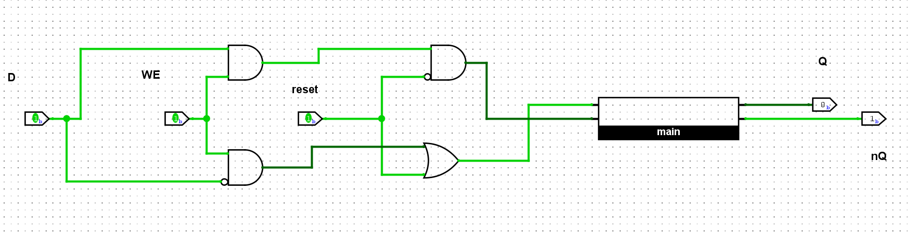

若将输出 $\overline{Q}$ 连接至输入 D，会出现明显震荡：
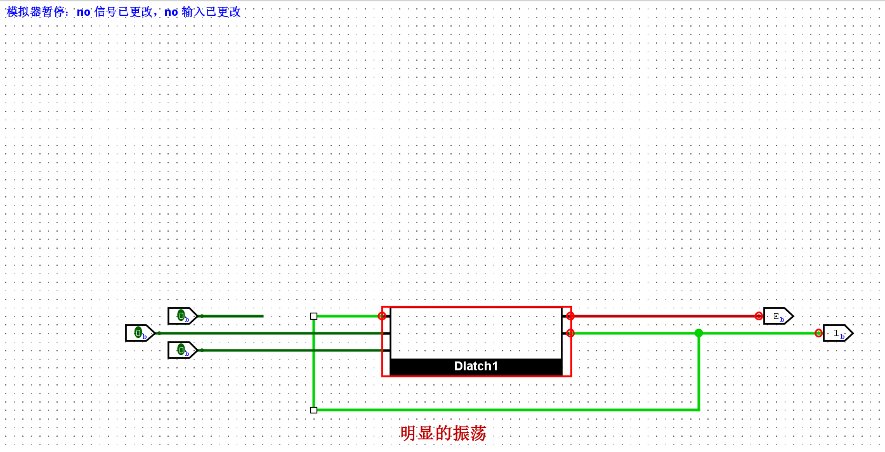

当 WE = 0 时，理论上不会产生震荡，这可能是logisim的仿真问题。

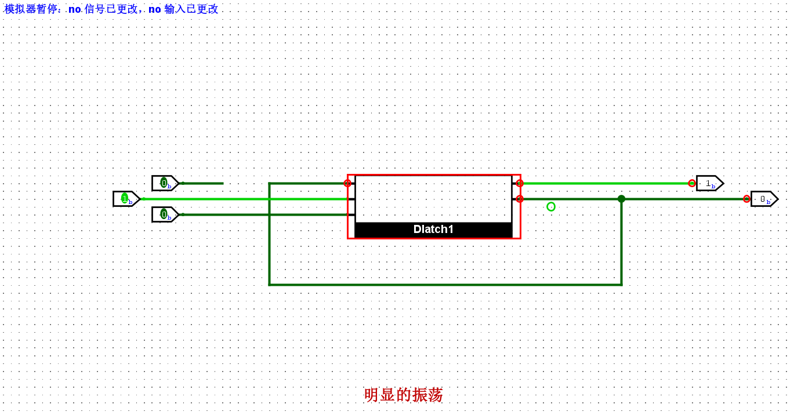

当 WE = 1 时，这样的连接会使 Q 在 0 和 1 之间不断来回切换（电平触发），从而导致震荡。

### D触发器

搭建带复位功能的D触发器：
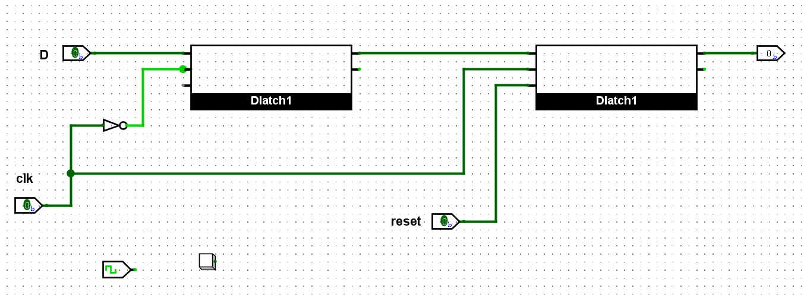

用D触发器实现位翻转功能：
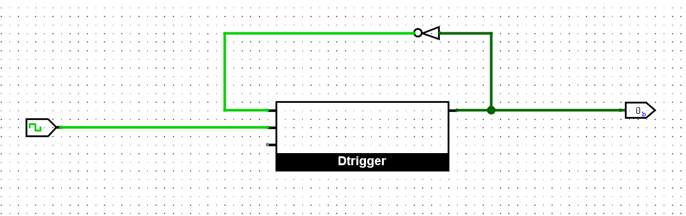

由于D触发器是边沿触发，因此不会出现电平触发的震荡问题，只有在时钟上升沿时才会翻转 Q。

搭建带使能端的D触发器：
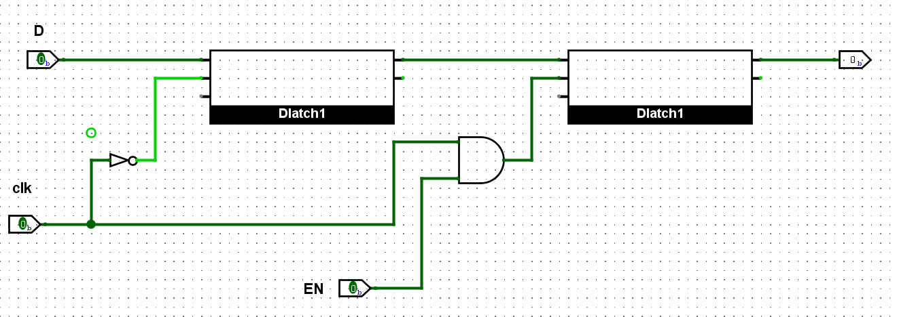

### 寄存器

做练习做力竭了，而且基本上凭感觉做的，所以没有解析。

搭建四位寄存器：
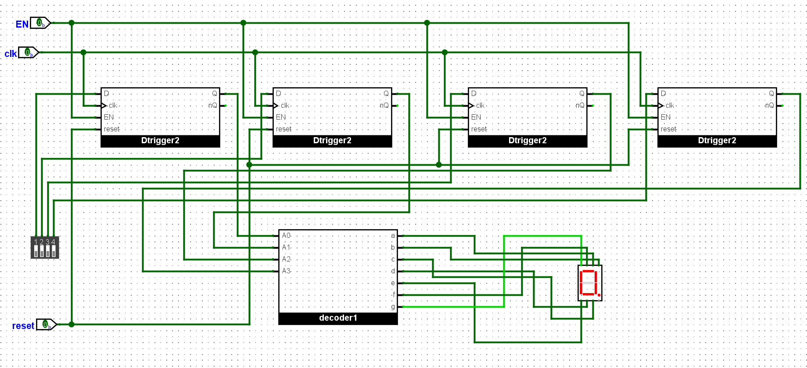

搭建四位计数器：
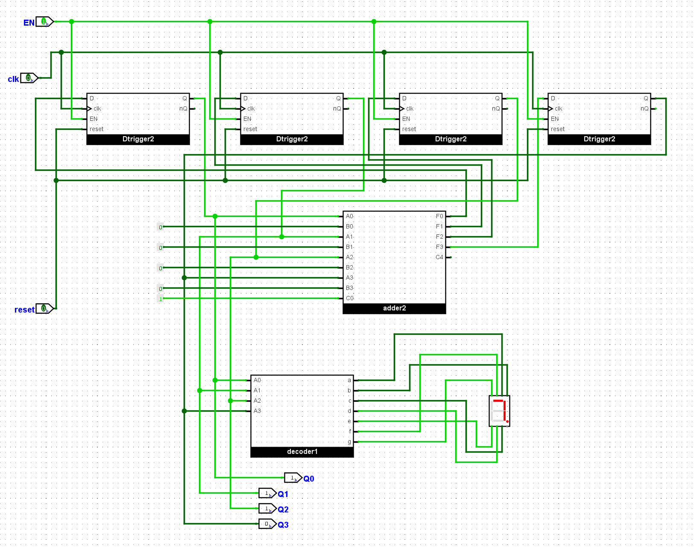

搭建求和电路：
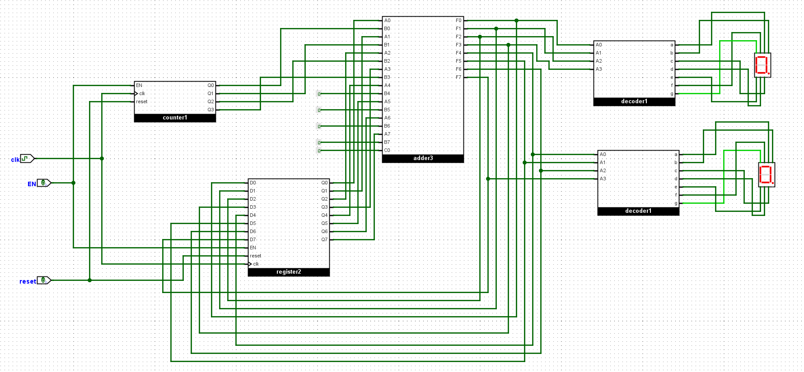

搭建电子时钟电路：

做了两个60分频，要加七段数码管的话，按十进制显示比较麻烦，按十六进制显示又有点奇怪，所以没加了。

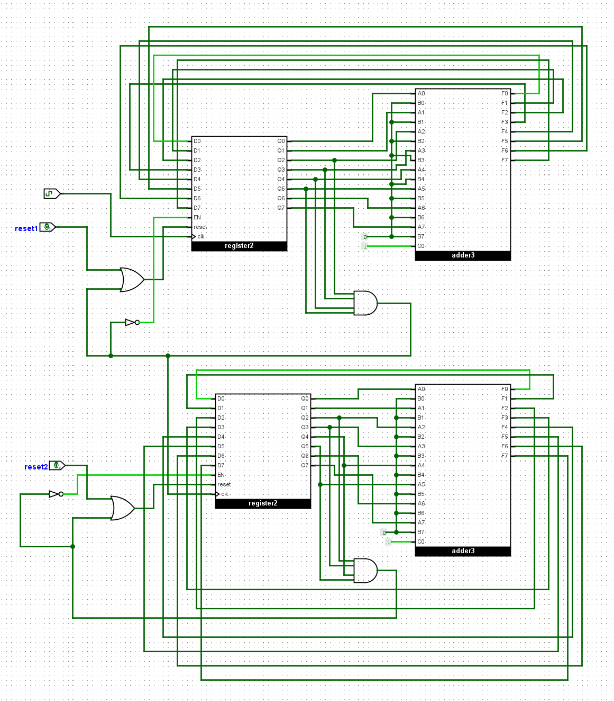

讲一下按十进制显示的思路：

以显示秒数为例，需要两个四位寄存器，分别表示秒的个位数和十位数，各自连接一个七段数码管。

每个时钟上升沿把个位寄存器的值加一，若加一后个位数大于9，则把个位数设为0，十位寄存器的值加一。

若加一后十位数大于5，则把十位数设为0，分钟的个位数寄存器加一。

若加一后分钟的个位数大于9，则把分钟的个位数设为0，分钟的十位数寄存器加一。

若加一后分钟的十位数大于5，则把分钟的十位数设为0。

其实就是10分频-6分频-10分频-6分频，每个寄存器表示一个时间单位（秒、分）的个位数或十位数。

搭建方法和60分频一样，就懒得搭电路了。

如果还要显示小时的话就再加两个四位寄存器，但是清零的组合逻辑电路复杂一些，就不写了。

完工于2026.3.15,1:43。

困死我了。